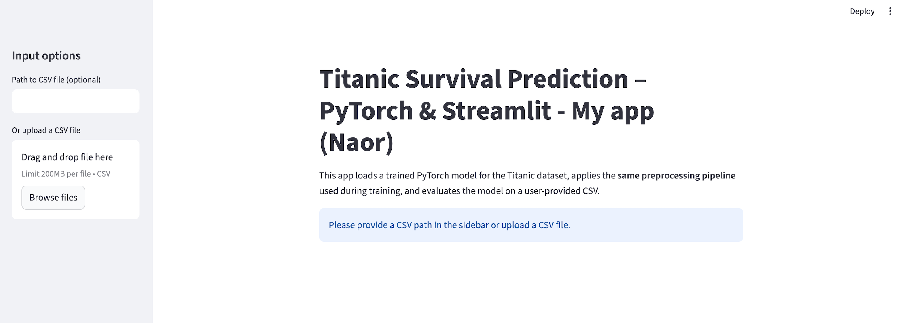

# 🚢 Titanic Survival Prediction (Data Science)
### PyTorch • Streamlit • Kaggle • EDA • Preprocessing • Inference UI

This project implements a **full machine learning pipeline** for predicting Titanic passenger survival, including:

- Automatic dataset fetching from **Kaggle**
- Full **EDA** in Jupyter Notebook
- **Preprocessing pipeline** (cleaning, imputation, encoding, scaling)
- **PyTorch classification model** (+ training script)
- **Model evaluation** on a held-out validation set
- **Interactive Streamlit app** for predictions & metrics

---

## 📦 Project Structure

```
.
├── data/
│   └── raw/          # Contains train.csv, test.csv (auto-downloaded or manual)
│
├── models/           # Saved model weights + scaler + feature names
│
├── notebooks/
│   └── eda.ipynb     # Full exploratory data analysis
│
├── src/
│   ├── data.py       # Downloading, preprocessing, feature engineering
│   ├── model.py      # MLP PyTorch model
│   └── __init__.py
│
├── train.py          # Training script (standalone)
├── ds_app.py         # Streamlit inference & evaluation UI
├── requirements.txt
└── README.md
```

---

## 1. Installation

```bash
git clone <your-repo-url>
cd <your-repo>
pip install -r requirements.txt
```

---

## 2. Fetching the Titanic Dataset

The dataset is automatically downloaded via Kaggle CLI:

```bash
python -m src.data
```

If Kaggle authentication is not available, the script will display a warning.

In that case, download manually from:

👉 https://www.kaggle.com/competitions/titanic/data

Place the files in:

```
data/raw/
    train.csv
    test.csv
    gender_submission.csv
```

---

## 🔍 3. Exploratory Data Analysis (EDA)

See:  
```
notebooks/eda.ipynb
```

Includes:

- Dataset overview (`head`, `info`, `describe`)
- Missing value analysis (Age, Embarked, Cabin)
- Survived distribution
- Age / Fare distributions
- Sex vs Survived
- Pclass vs Survived
- Embarked vs Survived
- Correlation heatmap
- Insights leading to preprocessing decisions

---

## 🛠️ 4. Preprocessing Pipeline

Implemented in **src/data.py**.

### ✔ Feature Cleaning  
- Drop: `PassengerId`, `Name`, `Ticket`, `Cabin`  
- Fill missing values:
  - `Embarked` → mode  
  - `Age` → median by (Sex, Pclass)

### ✔ Encoding  
- `Sex`: male → 1, female → 0  
- `Embarked`: S → 0, C → 1, Q → 2  

### ✔ Scaling  
Using `StandardScaler` on:

```
["Age", "SibSp", "Parch", "Fare", "Pclass"]
```

### ✔ Train / Validation Split  
80/20 split for held-out evaluation.

---

## 🤖 5. Model Architecture (PyTorch)

A **Multilayer Perceptron (MLP)** was chosen because:

- The data is **tabular** with only 7 engineered features.
- The task is **binary classification** (Survived).
- MLP captures non-linear interactions with very fast training.
- Compact network avoids overfitting on a small dataset (891 rows).
- PyTorch was a requirement of the assignment.

### Model:
```
Input (7 features)
→ Linear → ReLU
→ Linear → ReLU
→ Linear → Sigmoid (via BCEWithLogitsLoss)
```

---

## 🎯 6. Training the Model

Run:

```bash
python train.py
```

This script:

- Loads & preprocesses the dataset  
- Trains for 30 epochs
- Evaluates on validation set  
- Saves:

```
models/titanic_mlp.pt
models/scaler.pkl
models/feature_names.json
```

---

## 📊 7. Streamlit App (Inference + Evaluation)

Run:

```bash
streamlit run ds_app.py
```

### The UI allows:

#### ✔ Load any CSV file (path or upload)

If the CSV **contains Survived** → full evaluation:

- Accuracy  
- Precision  
- Recall  
- F1-score  
- Confusion Matrix (heatmap)  
- Probability Histogram  
- Prediction preview (true vs predicted)

If the CSV **does not contain Survived** (e.g., Kaggle test.csv):

- Only predictions are shown.

#### ✔ Uses trained PyTorch model + scaler  
Ensures consistent preprocessing for both training and inference.

---

## 📈 Example Streamlit Screenshot



---

## 🧠 Design Choices Summary

- **MLP chosen** due to tabular binary classification and PyTorch requirement.  
- **Median imputation by Sex×Pclass** preserves realistic age distributions.  
- **StandardScaler** mitigates skewed Fare and varying feature scales.  
- **Feature selection** guided by EDA insights and domain logic.  
- **Validation split** ensures reliable evaluation without leakage.  
- **Streamlit UI** completes the end-to-end ML workflow (data → model → inference).

---

## ✅ Status: Fully Complete End-to-End Pipeline

This project demonstrates:

- Data engineering  
- EDA & feature selection  
- Preprocessing pipelines  
- PyTorch modeling  
- Evaluation metrics  
- Real-time prediction interface  
- Clean reproducible code
